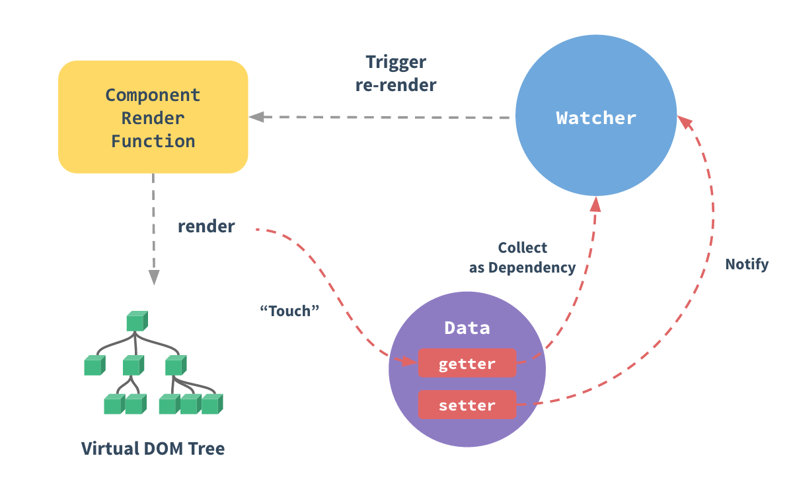
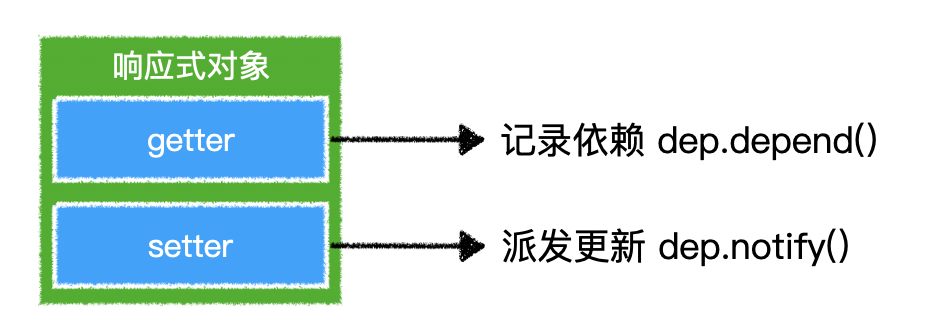
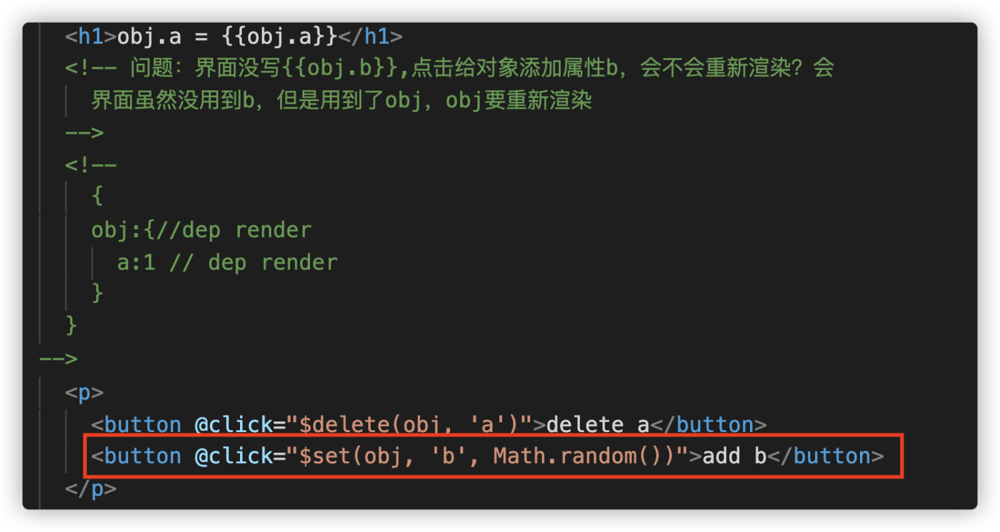
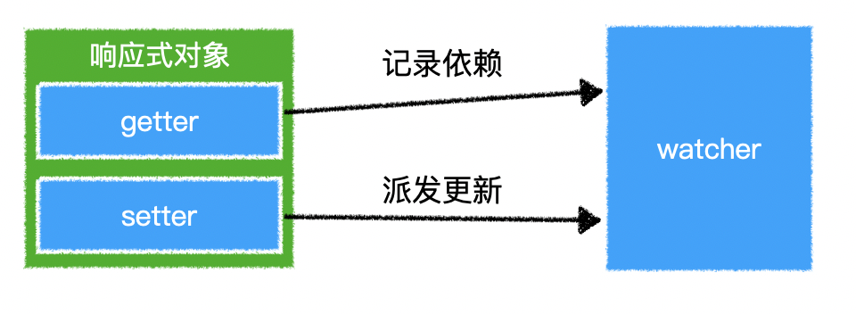
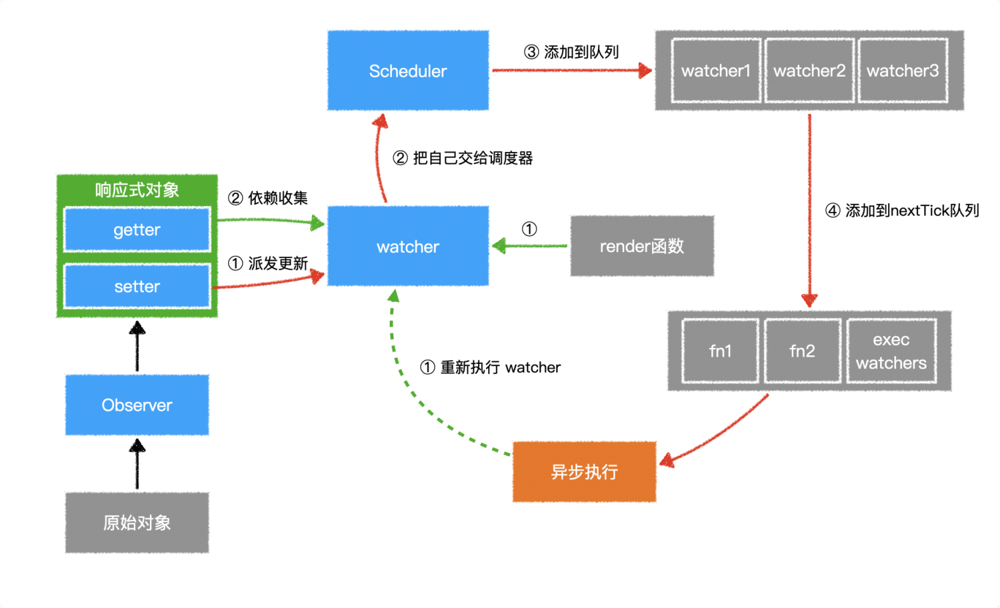

# Vue2 数据响应原理

## vue2 官方阐述

[https://cn.vuejs.org/v2/guide/reactivity.html](https://cn.vuejs.org/v2/guide/reactivity.html)


通过 `Object.defineProperty` 遍历对象的每一个属性，把数据变成 `getter`,`setter`。读取属性 `getter`, 更改属性 `setter`。形成了响应式数据。组件 `render` 函数会生成虚拟 `DOM` 树，影响到界面。怎么让响应式数据和虚拟 `dom` 连接起来呢？`render` 运行的时候用到了响应式数据，于是收集了依赖，数据 变化，会通知 `watch`，`watch` 会重新运行 render 函数

**响应式数据的最终目标**，是当对象本身或对象属性发生变化时，将会运行一些函数，最常见的就是 render 函数。
在具体实现上，vue2 用到了**几个核心模块**：

1. Observer
2. Dep
3. Watcher
4. Scheduler

## Observer

Observer 要实现的目标非常简单，就是把一个普通的对象转换为响应式的对象

为了实现这一点，Observer 把对象的每个属性通过 Object.defineProperty 转换为带有 getter 和 setter 的属性，这样一来，当访问或设置属性时，vue 就有机会做一些别的事情。


Observer 是 vue 内部的构造器，我们可以通过 Vue 提供的静态方法 Vue.observable( object )间接的使用该功能。

```javascript
var obj = {
  a: 1,
  c: {
    d: 3,
  },
  f: [
    {
      a: 1,
      b: 2,
    },
    3,
  ],
};
Vue.observable(obj); //递归遍历
```

在组件生命周期中，数据响应式发生在 `beforeCreate` 之后，`created` 之前。

具体实现上，它会递归遍历对象的所有属性，以完成深度的属性转换。

由于遍历时只能遍历到对象的当前属性，因此无法监测到将来动态增加或删除的属性，因此 vue 提供了`$set`和`$delete` 两个实例方法，让开发者通过这两个实例方法对已有响应式对象添加或删除属性。

对于数组，vue 会更改它的隐式原型，之所以这样做，是因为 vue 需要监听那些可能改变数组内容的方法


所以如果直接给数组的某一项（下标）直接赋值，监控不到

总之，Observer 的目标，就是要让一个对象，它属性的读取、赋值，内部数组的变化都要能够被 vue 感知到。

## Dep

这里有两个问题没解决，就是读取属性时要做什么事，而属性变化时要做什么事，这个问题需要依靠 Dep 来解决。
Dep 的含义是 Dependency，表示依赖的意思。
Vue 会为响应式对象中的每个属性、对象本身、数组本身创建一个 Dep 实例，

```js
const obj = {
  //dep
  a: 1, //dep
  n: [1, 2, 3], //dep
  d: {
    //dep
    p: 1, //dep
  },
};
```

每个 Dep 实例都有能力做以下两件事：

- 记录依赖：是谁在用我

- 派发更新：我变了，我要通知那些用到我的人

当读取响应式对象的某个属性时，它会进行依赖收集：有人用到了我

当改变某个属性时，它会派发更新：那些用我的人听好了，我变了



举个例子：



## Watcher

这里又出现一个问题，就是 Dep 如何知道是谁在用我？要解决这个问题，需要依靠另一个东西，就是 Watcher。

当某个函数执行的过程中，用到了响应式数据，响应式数据是无法知道是哪个函数在用自己的
vue 通过一种巧妙的办法来解决这个问题
**我们不要直接执行函数，而是把函数交给一个叫做 watcher 的东西去执行**，watcher 是一个对象，每个这样的函数执行时都应该创建一个 watcher，通过 watcher 去执行
**watcher 会设置一个全局变量，让全局变量记录当前负责执行的 watcher 等于自己，然后再去执行函数，在函数的执行过程中，如果发生了依赖记录 dep.depend()，那么 Dep 就会把这个全局变量记录下来，表示有一个 watcher 用到了我这个属性**

```javascript
window.currentWatcher = this; //接下来执行我
render(); // -->get(){dep.depend()}//通过全局变量来收集
window.currentWatcher = null;
```

当 Dep 进行派发更新时，它会通知之前记录的所有 watcher：我变了



每一个 vue 组件实例，都至少对应一个 watcher，该 watcher 中记录了该组件的 render 函数。
watcher 首先会把 render 函数运行一次以**收集依赖**，于是**那些在 render 中用到的响应式数据就会记录这个 watcher。**
当**数据变化**时，**dep 就会通知该 watcher**，而 watcher 将重新运行 render 函数，从而让界面重新渲染同时重新记录当前的依赖。

## Scheduler

现在还剩下最后一个问题，就是 Dep 通知 watcher 之后，如果 watcher 执行重运行对应的函数，就有可能导致函数频繁运行，从而导致效率低下

试想，如果一个交给 watcher 的函数，它里面用到了属性 a、b、c、d，那么 a、b、c、d 属性都会记录依赖，于是下面的代码将触发 4 次更新：

```javascript
state.a = "new data";
state.b = "new data";
state.c = "new data";
state.d = "new data";
```

这样显然是不合适的，因此，watcher 收到派发更新的通知后，实际上不是立即执行对应函数，而是把自己交给一个叫**调度器**的东西

调度器维护一个执行队列，该队列同一个 watcher 仅会存在一次，队列中的 watcher 不是立即执行，它会通过一个叫做 nextTick 的工具方法，把这些需要执行的 watcher 放入到事件循环的微队列中，nextTick 的具体做法是通过 Promise 完成的

nextTick 通过 this.$nextTick 暴露给开发者

也就是说，**当响应式数据变化时，render 函数的执行是异步的，并且在微队列中**

## 总体流程



Vue.js 是采用**数据劫持**结合**发布者-订阅者模式**的方式，通过 Object.defineProperty()来劫持各个属性的 setter，getter，在数据变动时发布消息给订阅者，触发相应的监听回调。主要分为以下几个步骤：

1. 需要 observe 的数据对象进行递归遍历，包括子属性对象的属性，都加上 setter 和 getter 这样的话，给这个对象的某个值赋值，就会触发 setter，那么就能监听到了数据变化
2. compile 解析模板指令，将模板中的变量替换成数据，然后初始化渲染页面视图，并将每个指令对应的节点绑定更新函数，添加监听数据的订阅者，一旦数据有变动，收到通知，更新视图
3. Watcher 订阅者是 Observer 和 Compile 之间通信的桥梁，主要做的事情是:

   ① 在自身实例化时往属性订阅器(dep)里面添加自己

   ② 自身必须有一个 update()方法

   ③ 待属性变动 dep.notice()通知时，能调用自身的 update()方法，并触发 Compile 中绑定的回调，则功成身退。

4. MVVM 作为数据绑定的入口，整合 Observer、Compile 和 Watcher 三者，通过 Observer 来监听自己的 model 数据变化，通过 Compile 来解析编译模板指令，最终利用 Watcher 搭起 Observer 和 Compile 之间的通信桥梁，达到数据变化 -> 视图更新；视图交互变化(input) -> 数据 model 变更的双向绑定效果。
